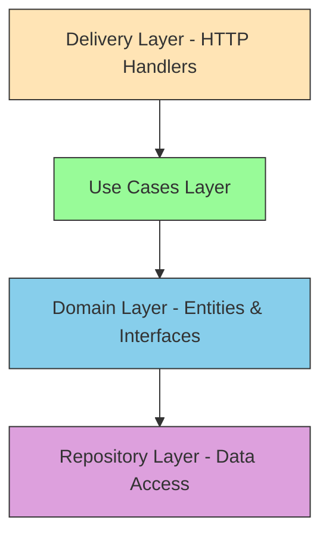
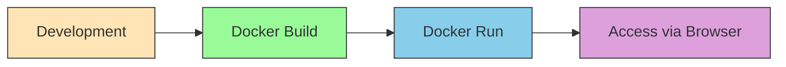

# Meme Generator Service Architecture

## Overview
This document describes the architecture of a meme generator service with a React frontend and Golang backend. The service allows users to view created memes and generate new ones through a web interface.

## System Components

### 1. Frontend (React 18.0)
- Web UI for viewing and creating memes
- Two main pages:
  - Gallery page: View created memes
  - Creation page: Generate new memes
- Communicates with backend via REST API

### 2. Backend (Golang + Gin v1.11.0)
- REST API server using Gin framework
- Clean architecture implementation
- Serves static files (React app)
- Provides endpoints for meme operations
- Includes CLI tool for meme generation

### 3. Data Storage
- File-based storage in `./data/memes/<meme_id>` directories
- Each meme has a unique ID and dedicated folder
- Meme data includes images and metadata

### 4. Deployment
- Docker containerization for both frontend and backend
- Single Docker image containing both services
- Backend serves React app statically

## Detailed Architecture

### Backend Clean Architecture Layers



#### 1. Delivery Layer (HTTP Handlers)
- Gin HTTP handlers
- Parse requests and format responses
- Validate input data
- Call use cases

#### 2. Use Cases Layer
- Business logic implementation
- Coordinate between delivery and repository layers
- Define application-specific rules

#### 3. Domain Layer
- Core entities (Meme, Template, etc.)
- Repository interfaces
- Business rules and validations

#### 4. Repository Layer
- File system operations
- Data persistence implementation
- Access to `./data/memes/` directory

### Project Structure

```
memes_generator/
├── cmd/
│   ├── web/              # Web server entry point
│   └── generate/         # CLI tool for meme generation
├── internal/
│   ├── delivery/         # HTTP handlers
│   ├── usecase/          # Business logic
│   ├── domain/           # Entities and interfaces
│   └── repository/       # Data access implementation
├── web/                  # React frontend application
│   ├── public/
│   └── src/
├── data/
│   └── memes/            # Generated memes storage
├── Dockerfile
└── docker-compose.yml
```

### API Endpoints

#### GET `/api/memes`
- Retrieve list of all memes
- Response: Array of meme objects with metadata

#### GET `/api/memes/{id}`
- Retrieve specific meme details
- Response: Meme object with metadata

#### POST `/api/memes`
- Create a new meme
- Request: Meme creation parameters
- Response: Created meme object

#### GET `/` (Static Files)
- Serve React application
- All non-API routes serve index.html for SPA

### Data Structure

Each meme is stored in `./data/memes/<meme_id>/` with:
- `metadata.json`: Meme information (ID, template, text, timestamps)
- `image.png`: Generated meme image
- Other assets as needed

### CLI Tool

A separate command in `cmd/generate/` accepts:
- Path to input folder
- Generates memes based on templates and text
- Stores results in the data directory

## Docker Configuration

Single Docker image containing:
- Compiled Golang backend
- Built React frontend
- Backend serves React app statically
- Exposes port 8080

Environment variables:
- PORT: Server port (default 8080)
- DATA_DIR: Data storage directory (default ./data)

## Deployment Flow



1. Developer creates/modifies code
2. Docker image is built with both frontend and backend
3. Container runs exposing web interface
4. Users access the service through browser